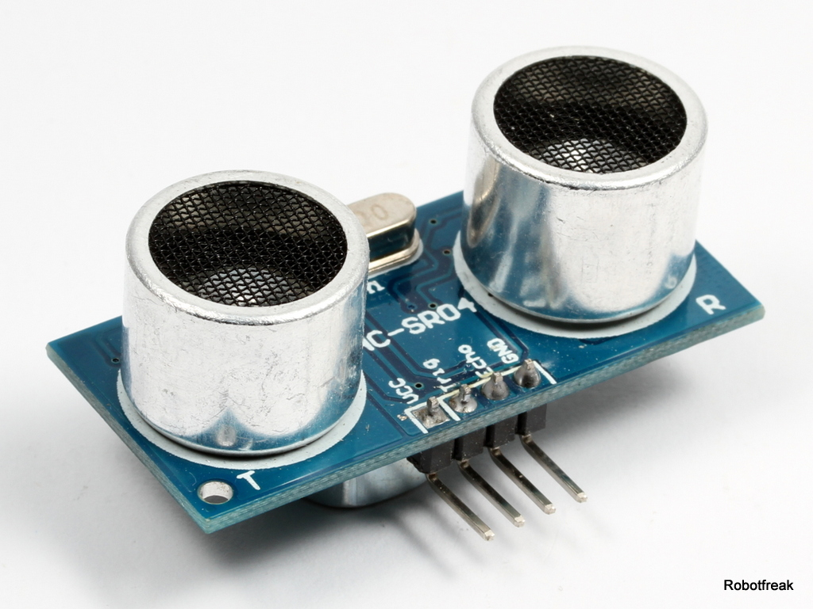
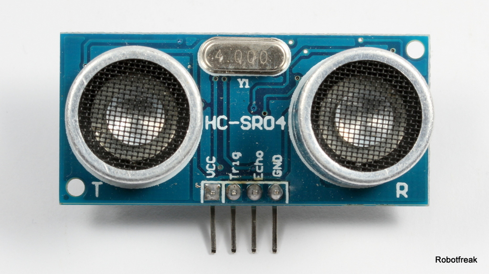
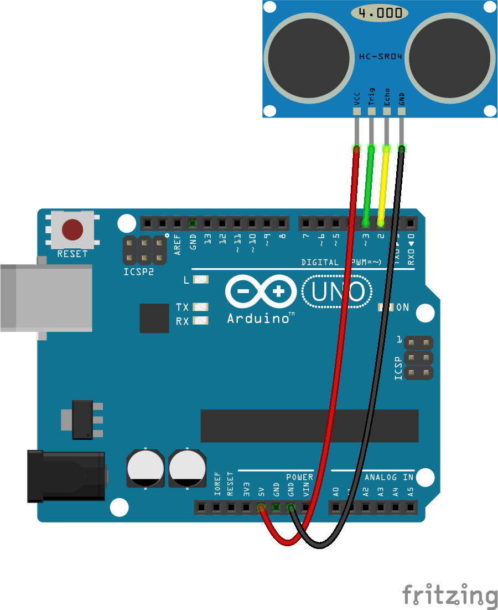
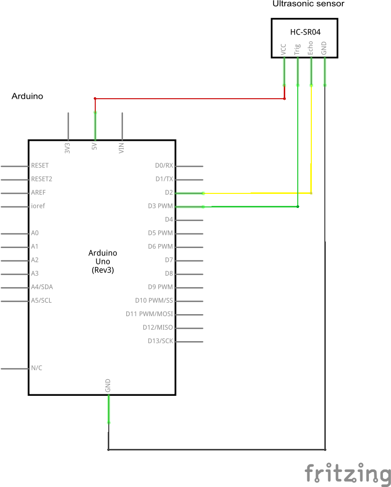

# HC-SR04

Der Ultraschallsensor HC-SR04 ist ein preiswerter Sensor um Entfernungen im Bereich 4cm bis 3m zu messen. Ideal für kleine Roboter zum Erkennen von Hindernissen.



## Wie funktioniert es?

Im Prinzip wie beim Ortungssinn der Fledermäuse. Der Sensor sendet kurze Burst von Ultraschallwellen über den Ultraschall Sender aus, lauscht dann auf die empafngenen Echos und misst dabei die Zeit, sie zwischen Senden und Empfangen vergehen. Die Schallwellen legen ca. 343 m/s zurück. Die Formel zur Umechnung der Signal Laufzeit in die Entfernung zum Hindernis in cm ist:

Entfernung(cm) = Schallgeschwindigkeit (m/s) / Laufzeit (s) / 2 * 100

Es wird durch 2x die Laufzeit geteilt weil das Signal erst zum Hindenis hin und wieder zurückläuft.


## Technische Daten

* Spannungsversorgung: 5V
* Stromaufnahme: 2mA
* max. Messrate: 50 Messungen pro Sekunde

## Pinbelegung

Pin 1: VCC
Pin 2: Trigger
Pin 3: Echo
Pin 4: GND



## Anschluss an den Arduino

zum Anschluss an ein Arduino Board werden 2 Digital I/Os benötigt. EInen Trigger Ausgang, der den Sende Burst startet und einen Echo Eingang.






## Programm für den Arduino

```c
#define TRIGGER_PIN  3
#define ECHO_PIN     2

long duration;
long cmMsec, inMsec;

void initHCSR04()
{
  pinMode(TRIGGER_PIN, OUTPUT);
  pinMode(ECHO_PIN, INPUT);
  digitalWrite(TRIGGER_PIN, LOW);
}

long readHCSR04()
{
  long pulsein;
  // The HC-SR04 is triggered by a HIGH pulse of 10 or more microseconds.
  digitalWrite(TRIGGER_PIN, HIGH);
  delayMicroseconds(10);
  digitalWrite(TRIGGER_PIN, LOW);
 
  // The same pin is used to read the signal from the HC-SR04 a HIGH
  // pulse whose duration is the time (in microseconds) from the sending
  // of the ping to the reception of its echo off of an object.
  pulsein = pulseIn(ECHO_PIN, HIGH);
  return pulsein;
}

long microsecondsToInches(long microseconds)
{
  // According to Parallax's datasheet for the PING))), there are
  // 73.746 microseconds per inch (i.e. sound travels at 1130 feet per
  // second).  This gives the distance travelled by the ping, outbound
  // and return, so we divide by 2 to get the distance of the obstacle.
  return microseconds / 74 / 2;
}
 
long microsecondsToCentimeters(long microseconds)
{
  // The speed of sound is 340 m/s or 29 microseconds per centimeter.
  // The ping travels out and back, so to find the distance of the
  // object we take half of the distance travelled.
  return microseconds / 29 / 2;
}

uint8_t EnPwmCmd[4]={0x44,0x02,0xbb,0x01};    // distance measure command

void PWM_Mode_Setup(){ 
  pinMode(TRIGGER_PIN,OUTPUT);                     // A low pull on pin COMP/TRIG
  digitalWrite(TRIGGER_PIN,HIGH);                  // Set to HIGH
  
  pinMode(ECHO_PIN, INPUT);                      // Sending Enable PWM mode command
  
  for(int i=0;i<4;i++){
      Serial.write(EnPwmCmd[i]);
   } 
}
 
void setup(){                                 // Serial initialization
  Serial.begin(9600);                         // Sets the baud rate to 9600
  PWM_Mode_Setup();
  initHCSR04();
}

void loop()
{
  duration = readHCSR04();
  
  cmMsec = microsecondsToCentimeters(duration);
  inMsec = microsecondsToInches(duration);
  
  Serial.print("CM: ");
  Serial.print(cmMsec);
  Serial.print(", IN: ");
  Serial.println(inMsec);

  delay(50);
}

```


