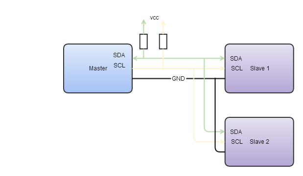

# I2C

[I2C](http://de.wikipedia.org/wiki/I2C), Inter-Integrated-Circuit, auch als TWI (Two-Wire-Interface) bezeichnet, ist ein synchroner serieller Bus. Hierüber lassen sich im Gegensatz zum UART auch mehrere Teilnehmer betreiben. Bei I2C handelt es sich um einen [[Master/Slave]](http://de.wikipedia.org/?title=Master/Slave)-Bus mit gemeinsamer Daten- und Takt-Leitung (SDA und SCL). Master/Slave klingt zunächst einmal sehr archaisch, wird aber in der Technik sehr häufig verwendet. Der Master initiiert Datenverbindungen, während der Sklave den Anweisungen des Masters lauscht und nur auf direkte Ansprache des Masters antworten darf. Da es nur eine Datenleitung gibt, ist bei I2C nur Halb-Duplex-Betrieb möglich, also entweder Lesen oder Schreiben. Nur ein Master kann eine Kommunikation anstoßen und Daten an einen Slave senden oder Daten vom Slave lesen. Zu diesem Zweck verfügt jeder Slave über eine eindeutige 7-Bit-Adresse, die innerhalb eines Bus-Systems nur einmal vorhanden sein darf und bei jeder Datenübertragung zuerst vom Master gesendet wird. 

Die Datenübertragungsrate beim I2C Bus beträgt 100 kHz oder 400 kHz. Zunächst wird vom I2C-Master die Startsequenz gesendet (die Datenleitung SDA wechselt von +HIGH+ zu +LOW+, während die Taktleitung SCL auf dem +HIGH+-Pegel bleibt). Die Taktleitung wird prinzipiell nur vom Master gesteuert. Der Slave hat aber die Möglichkeit, das Taktsignal zu verlängern, falls der Takt zu schnell für den Slave ist. Dieser Vorgang wird als Clock-Scretching bezeichnet. Anschließend folgt die 7-Bit-Adresse des Slaves (höchstes Adress-Bit zuerst), jeweils getaktet mit der SCL Leitung, gefolgt vom Read/Write-Bit (+LOW+ bedeutet Schreibbefehl, +HIGH+ Lesebefehl). Der angesprochene Slave antwortet mit einem Acknowlege (ACK), indem er die Datenleitung SDA für eine Taktlänge auf +LOW+ schaltet. Bei einem Schreibbefehl beginnt der I2C-Master damit, die Daten zum I2C -Slave zu senden, der jedes übertragene Byte mit einem Acknowledge bestätigt. Umgekehrt sendet der Slave die Daten und der Master quittiert mit einem Acknowledge bei einem Lesebefehl. Abgeschlossen wird  die Übertragung mit einer Stoppsequenz (Datenleitung SDA wechselt von +LOW+ zu +HIGH+, während die Taktleitung SCL auf dem +HIGH+-Pegel bleibt). 

Gängige Anwendungsbereiche der I2C-Schnittstelle sind die Anbindung von A/D- und D/A -Wandlern, Sensoren sowie digitalen Port-Erweiterungen. 

