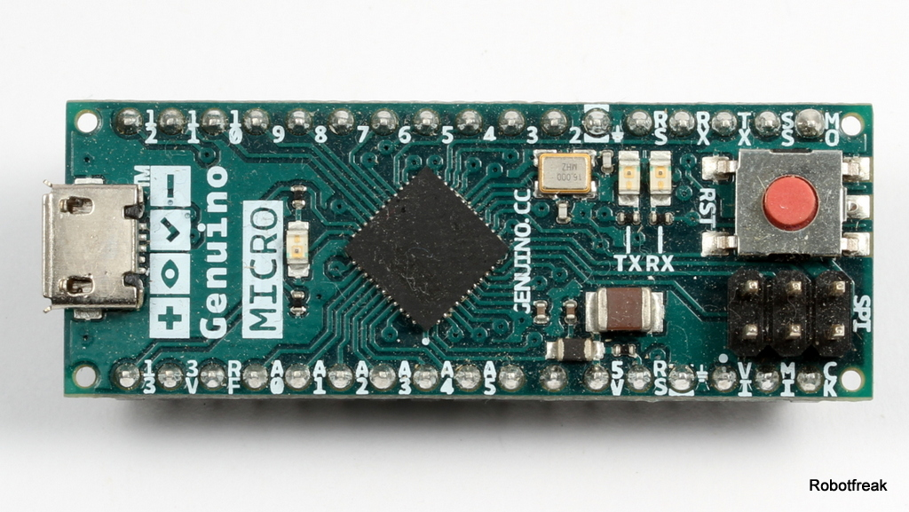
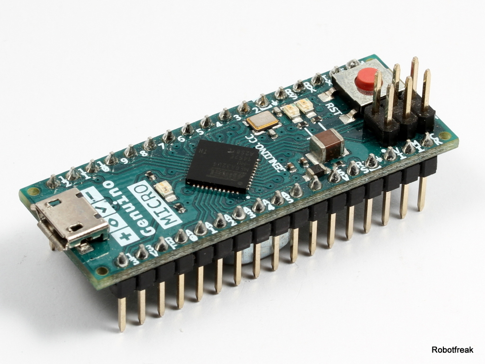

# Arduino / Genuino Micro

Der Arduino Micro ist ein Board im 34-poligen DIL Format. Nesonders geeignet für Steckbrett- und Lochraster Projekte. Es verfügt über einen ATmega32U4 als Prozessor, über den auch die USB Anbindung erfolgt.

## Hardware

Wie bei proktisch allen Arduino Boards verfügt der Arduino Micro über einen ATmega Prozessor von Atmel. 

### Eckdaten 

* Prozessor: 8-Bit RISC ATmega32U4 mit 32kB Flash (4kB Bootloader), 2.5kB RAM, 1kB EEPROM
* Versorgungspannung: 5V
* Eingangsspannung: 7-12V empfohlen, 6-20V Limits
* Prozessor Takt: 16MHz
* USB Chip: über ATmega32U4, USB Micro Anschluss
* Ein-/Ausgänge: 20 digitale IO davon 7x PWM, 12 analoge Eingänge (davon 6 shared mit digital IOs)
* max Strom pro I/O: 40mA
* Serielle Schnittstellen: 1x I2C, 1x SPI, 1x UART
* Sonstiges: OnBoard LED an Pin13 
* Formfaktor: 34 polig DIL, 48x18mm

### Pinbelegung

![Pinout]../images/ArduinoMicro_Pinout3.png) Source: Arduino.cc

### Ein- und Ausgänge

* Seriell (UART): Pin 0 (RX), Pin 1 (TX) Serial1, Serial über USB
* Externe Interrupts: Pin 2, 3 Interrupt auf steigende, fallende oder beide Flanken
* Pulsweitenmodulation PWM: Pin 3,5,6,9,10,11 ,13. 8-Bit PWM 
* Serial Peripheral Interface (SPI): Auf dem ISP Header, Pin MOSI, MISO, SCK
* I2C (TWI): Pin 2 (SDA), 3 (SCL)
* Analoge Eingänge: A0-A5, A6-A11 auf den Digital Pins 4,6,8,9,10,12
* AREF: Referenzspannung für analoge Eingänge
* Reset: LOW Signal zum Rest des Mikrocontrollers

### Stromversorgung
* USB:
* VIN: 
* 5V: 
* 3.3V: Ausgangs Versorgungsspannung des On-Board Spannungsreglers. max. 50mA
* GND: 

## Software

## Links
* [Board Beschreibung](https://www.arduino.cc/en/Main/ArduinoBoardMicro)
* [Schaltplan](https://www.arduino.cc/en/uploads/Main/arduino-micro-schematic.pdf)

