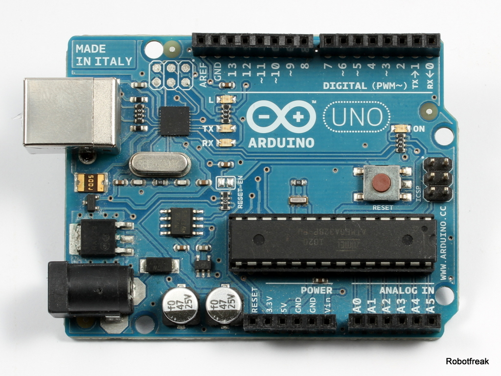
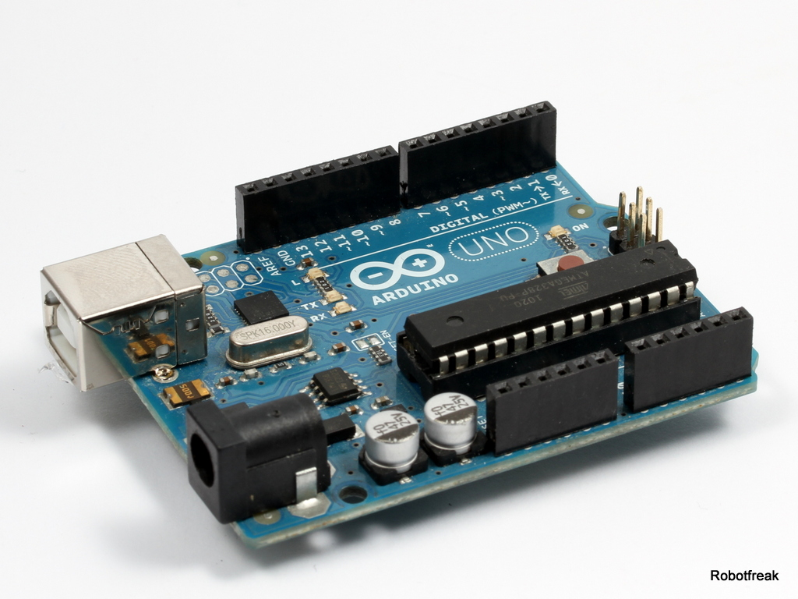

# Arduino/Genuino Uno

Der Arduino Uno ist quasi das Standard Board aus der Arduino Familie. 

## Hardware

Den Arduino/Genuino Uno gibt es mehreren Revisionen und einige Hardware Änderungen gegenüber den Vorgänger Modellen (FTDI USB Chip beim Diecimila, Duemilanove, NG). Während es sich bei den Board Abmessungen und dem verwendeten Prozessor keine Änderungen gegeben hat, gab es einige Änderungen an der Pin Belegung:

* zusätzliche Pins für I2C (neben dem AREF Pin)
* zusätzlicher IORef Pin  (neben dem Reset Pin)

Ansonsten sind die Modelle identisch.

### Eckdaten 

* Prozessor: 8-Bit RISC ATmega328P mit 32kB Flash (2kB Bootloader), 2kB RAM, 1kB EEPROM
* Versorgungspannung: 5V
* Eingangsspannung: 7-12V empfohlen, 6-20V Limits
* Prozessor Takt: 16MHz
* USB: FT232 Chip ( Diecimila, Duemilanove, NG), Atmega16U4 beim Uno, USB B Anschluss
* Ein-/Ausgänge: : 14 digitale IO davon 6x PWM, 6 analoge Eingänge (davon 2 alternativ für I2C)
* max Strom pro I/O: 40mA
* Serielle Schnittstellen: I2C, SPI, UART
* Sonstiges: OnBoard LED an Pin13,  
* Formfaktor: Arduino Standard, 69x54mm

### Pinbelegung

 
Source: Arduino.cc

### Ein- und Ausgänge

* Seriell (UART): Pin 0 (RX), Pin 1 (TX)
* Externe Interrupts: Pin 2, 3 Interrupt auf steigende, fallende oder beide Flanken
* Pulsweitenmodulation PWM: Pin 3,5,6,9,10,11 . 8-Bit PWM 
* Serial Peropheral Interface (SPI): Pin 10 (SS), 11 (MOSI), 12 (MISO) 13 (SCK)
* I2C (TWI): Pin A4 (SDA), A5 (SCL)
* Analoge Eingänge: A0-A7
* AREF: Referenzspannung für analoge Eingänge
* Reset: LOW Signal zum Neustarten des Mikrocontrollers

### Stromversorgung
* USB: 5V Versorgungsspannung über USB Port
* VIN: 6-20V ungeregelte Eingangs Versorgungsspannung
* 5V: geregelte Ausgangs Versorgungsspannung des On-Board Spannungsreglers
* 3.3V: geregelte Ausgangs Versorgungsspannung des On-Board Spannungsreglers. max. 50mA
* GND: Massepegel der Versorgungsspannung 

## Software

## Links

* [Board Beschreibung](https://www.arduino.cc/en/Main/ArduinoBoardUno)
* [Schaltplan](https://www.arduino.cc/en/uploads/Main/Arduino_Uno_Rev3-schematic.pdf)

